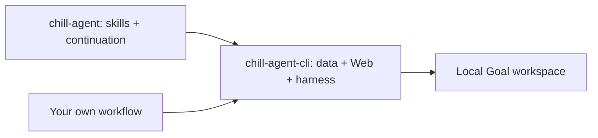

<p align="center"></p>

<p align="center"><a href="https://github.com/game-dev-rta-club/chill-agnet/actions"></a>  </p>

# Work you can leave with an agent

chill-agent gives you a shared place to shape a goal, leave feedback, and return to progress. Optional continuation checks help an agent pick up agreed work after it stops.

| Make the work visible | Keep the conversation together | Stay in control |
| --- | --- | --- |
| Nested Goals and readable Briefs | Annotate results; answer Letters | Native queue, Pause and Resume |

<p align="center"></p>

## Try it

**Current integration: Codex Desktop on macOS, Node.js 24.** Core data commands are
portable; other Desktop harnesses are not connected yet. Messaging and remote
access are optional and off by default.

```sh
git clone https://github.com/game-dev-rta-club/chill-agnet.git
cd chill-agnet
npm ci
npm run build
node bin/chill.mjs setup prepare --project /path/to/your/project
# Use the stable command printed by setup:
# <command> server start --configured
```

For the skill-driven experience, load the built `dist/codex/chill-agent` plugin in Codex, then ask it to use chill-agent. The adjacent message-setup plugin is optional.

## Two packages, one workspace



- [chill-agent](https://github.com/game-dev-rta-club/chill-agnet) composes the complete experience.
- [chill-agent-cli](https://github.com/game-dev-rta-club/chill-agent-cli) exposes the foundation and a versioned extension contract.
- The complete package pins one tested CLI release. No separate global CLI is required.
- Repository updates do not move your Goal data. Runtime snapshots preserve the running version until restart.

## How it feels

1. Describe an outcome and agree on the scope.
2. Read the current Brief; leave comments on the parts that matter.
3. Let the agent work. Answer a Letter when a decision needs you.
4. Review the result. Keep going, refine it, or mark the Goal done.

The 24h control turns continuation on or off per Root Goal. It checks every 30 seconds and sends at most two nudges per substantive change. Running work, queued feedback, a manual pause, or uncertain state prevents a nudge. Turning it off does not cancel work already queued.

## Develop and contribute

```sh
npm ci
npm run check
```

Small fixes can go straight to a pull request. Discuss behavior and protocol changes
in an issue first. See [Contributing](CONTRIBUTING.md), [Releases](RELEASING.md),
[Security](SECURITY.md) and the [MIT license](LICENSE).

This is experimental software. Keep backups of important workspaces.
