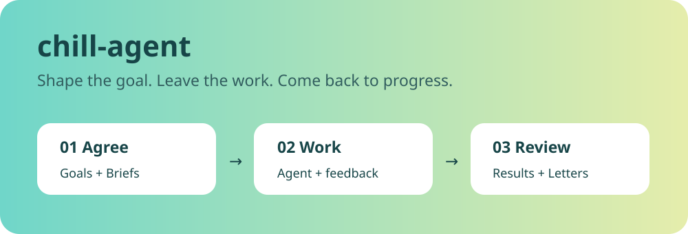
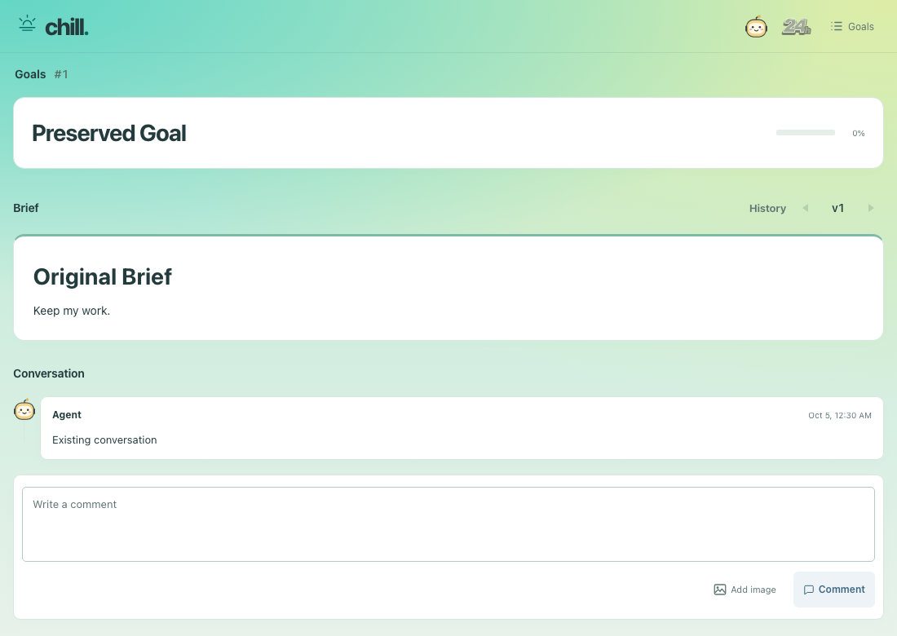

  

# Work you can leave with an agent

Describe what you want to achieve, agree on a direction, and let your agent get to work. chill-agent keeps the plan, progress, and questions in one place—so you can come back without catching up on a long chat.

| Agree on the goal | Leave useful feedback | Stay in control |
| --- | --- | --- |
| See the plan and progress | Comment right on the work | Pause, resume, or change direction |

## A place to come back to

- **Goals** describe the outcome. Larger jobs can be split into smaller Goals.
- **Briefs** show the current plan or result, ready to read and comment on.
- **Letters** bring you questions that need your decision.

Your agent uses the same workspace. You can shape the work as it goes, without having to repeat the whole conversation.

Want help keeping things moving? Turn on [AutoContinue](docs/using/auto-continue.md). After the agent's run ends, chill-agent asks it to pick up any agreed work it can continue. You stay in control of what it takes on.

## Get started

Install the complete `chill-agent` skill folder in your usual skill location,
then invoke **chill-agent** in the project you want to work on. The agent prepares
that project's workspace and opens its Web page; there is no separate setup
command for you to run.

The same folder works in **Codex Desktop** and **Claude Code (experimental connection)** on macOS.
Node.js 24.15 or newer is required. See
[Install the skill](docs/using/install.md) for locations and how to obtain the
built folder. Initial native Hook approval may still be required; Claude may
also need to resume the same conversation to activate its connection. The agent
explains only the remaining native step.

Optional [notifications](docs/using/notifications.md),
[phone access](docs/using/public-link.md) and color themes live in the Web's
**More** menu. Installation does not enable them.

Next, see [how to work together](docs/using/working-together.md), or find a focused guide in [the documentation](docs/README.md).

For the experimental Claude Code connection, see [setup](docs/development/claude-plugin.md)
and [receiving Web feedback](docs/using/claude-code.md).

## Building your own workflow?

Use [chill-agent-cli](https://github.com/game-dev-rta-club/chill-agent-cli) if you want the workspace and agent connection with your own scheduling or orchestration. Its repository owns the CLI reference and extension documentation.

## Help make it better

Ideas, small fixes, and clearer wording are welcome. Start with [Contributing](CONTRIBUTING.md). Maintainers can find the release process in [Releasing](RELEASING.md).

[Security](SECURITY.md) · [MIT license](LICENSE)

This is experimental software. Keep backups of important workspaces.
