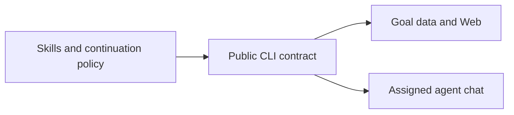

# Two repositories, one server

The all-in-one package depends on one exact CLI release archive. `npm run build`
assembles a self-contained runtime from the CLI package's public runtime export and
adds the monitor module and command manifest. The runtime runs one Web server.

| Responsibility | Owner |
| --- | --- |
| Goal data, Briefs, Conversation and Letters | CLI |
| Web interface, native delivery, execution locks and queue/pause observations | CLI |
| Trusted extension hosting and common Web controls | CLI |
| Skills, package composition and continuation decisions | Main package |
| Request wording, attempt allowance and result journal | Main package |

The dependency points from this package to the CLI. The monitor imports the
versioned public extension API; it does not own the CLI's internal files.
Standalone CLI users can bring a different policy without installing this one.

The [AutoContinue guide](using/auto-continue.md) owns the policy explanation.
The CLI owns [extension mechanics](https://github.com/game-dev-rta-club/chill-agent-cli/blob/main/docs/extensions.md)
and [server lifetime](https://github.com/game-dev-rta-club/chill-agent-cli/blob/main/docs/runtime/server.md).
The extension tells that host when its work still needs it: active, unresolved
or potentially eligible work can delay idle shutdown; enablement alone is not
a permanent keep-alive. An observation failure does not establish that work ended.

Existing data remains in the same directory. The continuation journal keeps its
path and attempt IDs. Legacy per-Root launchd jobs are retired when the extension
starts. No monitor is enabled by installation or migration.

Source history before extraction is retained locally; public repositories start
with reviewed distribution source, without local research notes or personal data.

See [build layout](development/build-and-plugins.md) for the generated artifacts
and [cross-repository development](development/two-repositories.md) for changing
the combination. Exact dependency selection lives in [package.json](../package.json)
and its lockfile, not in an independently maintained version table.
